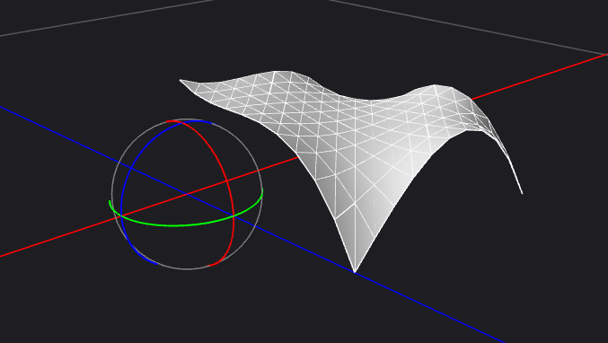

<center><font size=5>作业1</font></center>
<h3>1.实现全部类</h3>


这要实现这7个类，用vs的创建类，创建一下就完成了，但是一运行，出了问题。有很多的问题，该多160个左右，我开始看的很头疼，就去打了一会游戏，再回来的时候，bug还是在，我记得bug主要是未识别标识符，我找了很久的，想不通为什么，然后我就出stackoverflow上面看了看，那上面意思大改是说，预编译什么#program on这个要去掉，我去掉之后错误少了很多，然后还是有部分错误,之后在网上查到，是因为没有把pch.h这个预编译的头文件放在最开始，然后之后的问题，就少了很多，就是重定义了，这个第一的时候我就碰到了，那个时候张建波老师就告诉我怎么处理这些问题了，这些问题处理完以后，就可以运行了，出现了一个黑的图像框。不过折腾了很久，不过多态性写这个题目太舒服了。

<h3>2.完成bezier曲线和bspline曲线</h3>

在开始之前，我先去问了隔壁的许鸿飞同学，如何把参数加入主程序运行，说实话这是我第二次碰到这中主函数里调用参数的情况，所以有点懵逼。


再开始之后，我调试了很久，走了很多步骤，才弄清楚每一步在干嘛，然后在编写时候，就感觉这个步骤其实很简单，就是把bezier曲线写出来然后将curve_revoltion的分割的次数平分，然后去跑方程就把的出来的点在连接起来。我有点搞不懂的是vecf3和vecf2为什么要给这几个，感觉只用一个vecf3就行了。

然后就是那个函数的主要代码了，我开始的时候还没看到那个矩阵类，所以就一个一个打出来的，没有用上矩阵的方法。
```c++
vector<Vec3f> BezierCurve::compu(ArgParser *args,int c) {
	vector<Vec3f> point;
	float t=0;
	float add = 1.0/args->curve_tessellation;
	cout << add<<endl;
	//cout << number;
	for (int i = 0; i <=args->curve_tessellation; i++) {
		if (i == args->curve_tessellation)
			t = 1;
		float x = powf((1 - t), 3)*para[c+0].x() + 3 * t*powf((1 - t), 2)*para[c+1].x() + 3 * pow(t, 2)*(1 - t)*para[c+2].x() + pow(t, 3)*para[c+3].x();
		float y = powf((1 - t), 3)*para[c+0].y() + 3 * t*powf((1 - t), 2)*para[c+1].y() + 3 * pow(t, 2)*(1 - t)*para[c+2].y() + pow(t, 3)*para[c+3].y();
		float z = powf((1 - t), 3)*para[c+0].z() + 3 * t*powf((1 - t), 2)*para[c+1].z() + 3 * pow(t, 2)*(1 - t)*para[c+2].z() + pow(t, 3)*para[c+3].z();
		//cout << x << " " << y << " " << z << endl;
		//v.Get(x, y, z);
		Vec3f v(x,y,z);
		point.push_back(v);
		temp_point.push_back(v);
		t = t + add;
		//cout << t; 
		if (i == 29)
			int a = 0;
	}
	
	return point;
}
```

然后bspline条的差不多就是我感觉一直重复写那些方程太累了，然后用了下#define把他们变短，看起来舒服一点

然后就是结果了
bezier


bspline


<h3>3.曲线相互转化</h3>

这个的思路其实很简单，只要用老师ppt上的那个公式实现成了代码就很方便，我开始的时候有一点慌，因为我没看见那个矩阵类，然后就感觉那些矩阵运算就很麻烦，后来才发现了这个类，发现我只需要写一个txt将那几个参数放进去，然后通过文件读写读入数组就可以，然后在用矩阵类初始化。最后就是矩阵的运算了。我现在vs上调试了，然后在网上矩阵计算器试了试数据，没问题后，运行下就可以了。

```c++
void BezierCurve::init()
{
	FILE *fpx;
	fpx=fopen("parament.txt","r");
	for (int i = 0; i < 8; i++) {
		if (i < 4)
		{
			float a[4];
			int count = fscanf(fpx, "%f %f %f %f", &a[0], &a[1], &a[2], &a[3]);
			for(int j=0;j<4;j++)
			{
				tempb.Set(j, i, a[j]);
			}
		}
		else {
			float a[4];
			int count = fscanf(fpx, "%f %f %f %f", &a[0], &a[1], &a[2], &a[3]);
			for (int j = 0; j < 4; j++)
			{
				tempsp.Set(j, i-4, a[j]);
			}
		}
	}
	for (int i = 0; i < para.size(); i++) {
		para_martrix.Set(i, 0, para[i].x());
		para_martrix.Set(i, 1, para[i].y());
		para_martrix.Set(i, 2, para[i].z());
	}
```
这一块代码是写死的，因为毕竟参数矩阵是固定的，所以没必要去指定大小。后面就直接用矩阵类给出来的操作就行了。

bezier转化为bsple


bspilne转化为bezier


另外bezier转化为bezier的我没有展示出来，感觉没有点的操作的话没有太大的必要截图去展示。。因为我就是拿原图来也是一样的。

<h3>4.多个点的bezier和bspline曲线画图</h3>

这个地方其实没啥难度，如果已经完成了前面的工作，不过我说过，我一直一位是4个点固定的，所以我就没考虑过他可能一次这么多点的情况，然后我又比较懒，所以只是在曲线过程函数的前面加了一个参数用来控制点的次序，只是类似于在4个点的基础上加上了c*4这个前置，然后在外围添加了ifelse条件判断，但是在我写到后面发现没有必要去弄这个，比较这个for循环实在外部，所以我已经通过参数去改变了他的返回过程，就没必要要了。

然后就是这2个曲线的多点过程也不同，我开始只看了bezier曲线的是将前4个点的最后一点作为下一个点的开始，然后我去画这个，我以为bspline也是一样的，所以我用同样的方法去画了bspline的结果画的特别的尖锐和扭曲，我但是一想这个好像有点区别，我就随便一试将开始点下一个点作为下4个点的开始，然后就好了，虽然有一点侥幸，但是一试就好了，我也没有管了。

结果图

bezier


bspline


bspline2


<h3>5.鼠标的操作</h3>

这个其实我开始没有写，我最后才写的。
这个其实我没怎么去看函数，不过他让我实现那2个方法，然后只要去改变被选择的点的后来的位置就行了。
这个地方我写的时候也碰到了一个小bug，就是我加点的时候他会不停的变短，后来我转到他的函数，我把他的个数定了，然后他只会固定去读初始化的那个number个数的点。

结果

这个是吧上一张图的改成这样了，加了几个点。


<h3>6.曲面操作</h3>

这个的思路就是将这个图像绕着某一个轴转就行了，一开始我觉得很奇怪，因为他根本没法制定怎么旋转呀，后来才发现我都说明的时候跳过了以y轴旋转这个了，选择次数是10此，然后就好办了，首先这是一个x，y是我们看见的平面，然后z轴存在于垂直于屏幕的哪一个面，然后用笔画一下，就可以轻易的知道他们旋转之间的关系是x，z的cos和sin。要注意是这个math文件里的acos和asin是弧度制的，我之前一次写java作业的时候遇到过，之后查了下，才知道好像网上这些数学的全是弧度制。

然后旋转完后，需要做的是将这些空架的点相互连接成三角形，这里有给好的类。我画了第一个图形挺顺利的，但是画第二个的时候就出了问题。他的外形都在但是那些不是三角形很尖锐。就像下面这样


或许你这样看还是没有感觉出什么问题，我开始也是这么觉得。知道我看了bspline的那个就知道出了问题


可以明显看到出来这个肯定是有问题的。这个bug我处理了2天，虽然一天可能就1个小时左右。我开始以为实我的点的位置可能出了问题，但是我调试了一会之后，仔细想了想，他的外形是对的，不该是点的问题，那之后我就怀疑是我的三角形的问题，我把三角形过程看了看也没发现什么问题。我就有一点想不通了，因为我处理数据的时候都是用的low的那个txt，high的太多了我看不出问题。最后我试着去改了input的那些参数，然后看了那些数据最后发现一个规律，无论我怎么改从图像上看，并不是所以的都不是由3角形组成的，我在看了obj的数据后发现了bug在哪里，是一个很小的问题，但是并不是很好发现，我在最开始函数处理的内部，我把一个本应该随着input参数改变的变量设置成了一个常量，所以我一直没有去向这里，因为我一直调试的是8个点的那个图像。所以代码习惯和调试方法还需要去提升下。

结果
bezier

low


high


bspline

low


high


<h3>7.张量积</h3>
这个写起来调试以及所有操作加起来估计也没有1个小数，这个老师给的那个函数太tm好用了。只需要把点弄出来，然后放进去就行了。把点怎么弄出来，我开始没想明白，因为我该用那些点来组合出来4个点在一起来了。是没4个一份一份还是怎么样，后来我猜测应该这样做是可行的，因为他们每4个点的z轴是相等的。所以那4个点实在一个面的，所以我看了ppt那张图，那个图我看了感觉理解起来还挺容易的。因为之前上课听的时候，说过要怎么操作。然后就把4个点做出新的bezier曲线，然后在曲线上，继续取点，最后在按照每一个的顺序在做一个bezier曲线，在取点，然后就完成了点的操作。我觉老师给的那个函数贼厉害。那个逻辑如果让我去写，我估计要调试很久，而且我也没有想过先去取三角形再去取点，我就感觉这一个点很牛逼，思路太清晰了。能够利用借口去定义点怎么取，很佩服trianglenet这个的构造函数。

结果

low


middle



high


<h3>8.茶壶</h3>

这个就直接展示结果了


其实没有做我就预感到这个我不需要去做，因为我在看见这张图的时候就想到了，壶身通过旋转嘴和把手通过patch做出来，所以我直接没有调试这个过程，直接运行我知道我肯定能得到结果的。而且通过最后一张图可以很清楚看出那些是通过旋转那些是通过张量积画的。

<h3>9小结</h3>

做了
